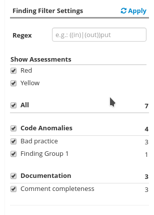
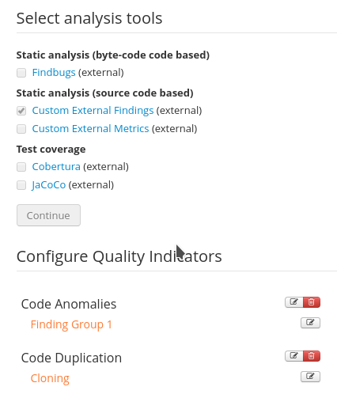
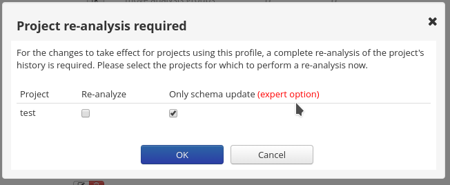
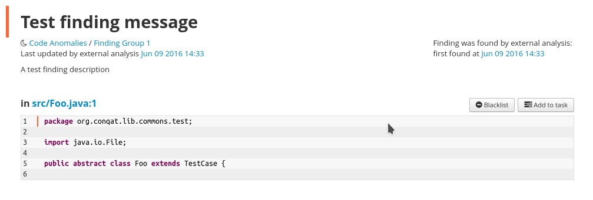

How to add arbitrary external findings to Teamscale using the Python API
========================================================================

Adding new Findings to Teamscale is comprised of 4 Steps:

#. Add a new findings group 
#. Add a finding description for each type of finding you want to upload
#. Update the analysis profile to contain the new finding group
#. Upload the findings

Steps 1-3 are one-time setup tasks, whereas 4 will be repeated every time new findings shall be added.

1. Add a new findings group
---------------------------
First a new group has to be created. A group contains multiple different types of (usually related) 
finding types. A group can be created like this::

  client.add_findings_group("Finding Group 1", "external-findings-.*")

The Group has a name that will be visible in the Teamscale UI (for example as a filter in the Findings View). The regex will be used to find all matching finding descriptions that shall be grouped under the given name.

2. Add a finding description
----------------------------
For each type of finding that is to be uploaded, a new description must be added. A description is comprised of an id
that is used to identify the type of finding, a description that is displayed whenever a finding of this type
is shown in detail and a default enablement/severity.

Finding descriptions can be added like this::

  descriptions = [
     FindingDescription("external-finding-1", "A test finding description", Enablement.RED)
  ]
  client.add_finding_descriptions(descriptions)

3. Update the analysis profile
------------------------------
The third step is updating the analysis profile used by the profile. Either create a new profile or edit an existing profile.
When editing the profile enable the ``Custom External Findings`` external tool in the external tools step of the analysis profile wizard.

The created finding groups will then be available as analysis group. They are grouped under the quality indicator ``Code Anomalies`` by default.

These can be edited to override the default enablement or deactivated completely.

Save the analysis profile. 

In case the profile references existing projects that use this profile, you can enable the expert settings in the ``Project re-analysis required`` dialog 
and enable ``Only Schema update`` for the required projects.

4. Upload the findings
----------------------
In the last step, you upload the concrete findings using ids from the previously created finding descriptions::

  findings = [
      FileFindings([Finding("external-finding-1", "Test finding message", start_line=1)], "src/Foo.java")
  ]
  client.upload_findings(findings, datetime.datetime.now(), "TestCommit", "test-partition")

If everything worked you should be able to see the new finding and the details will be shown:

